# 🎬 Netflix Data Analysis Project  
**Internship Project at Unified Mentor Private Limited**

This project explores the Netflix dataset using Python for data analysis and machine learning, and Power BI for visual storytelling. It was completed as part of my internship at **Unified Mentor Pvt Ltd**.

---

## 📂 Folder Structure

netflix-data-analysis/
├── data/ # Raw and cleaned data files
├── analysis/ # Jupyter Notebook for EDA & ML
├── eda_screenshots/ # Python EDA visualizations (plot1–plot11)
├── dashboards/ # Power BI dashboard screenshots
├── netflix_dashboard.pbix # Main Power BI file
└── README.md # This file

php-template

---

## 🧪 Exploratory Data Analysis (Python)

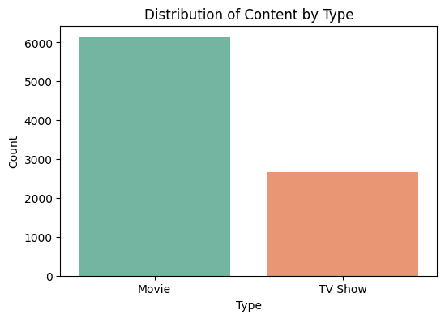

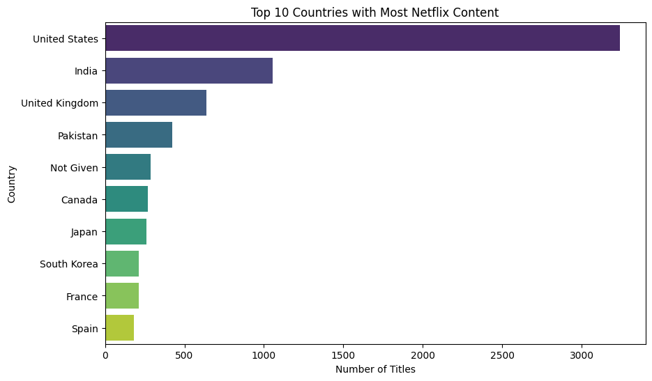

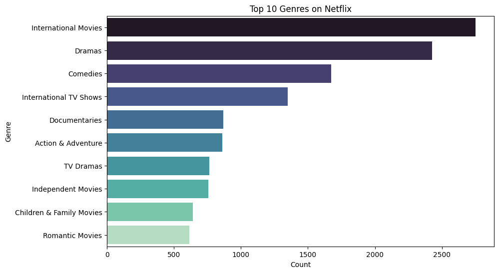

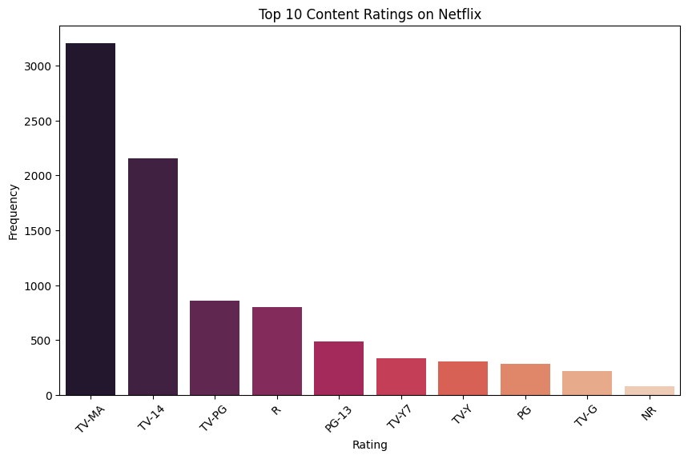

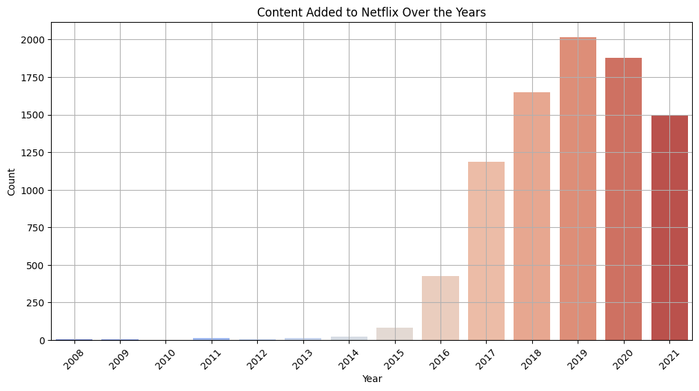

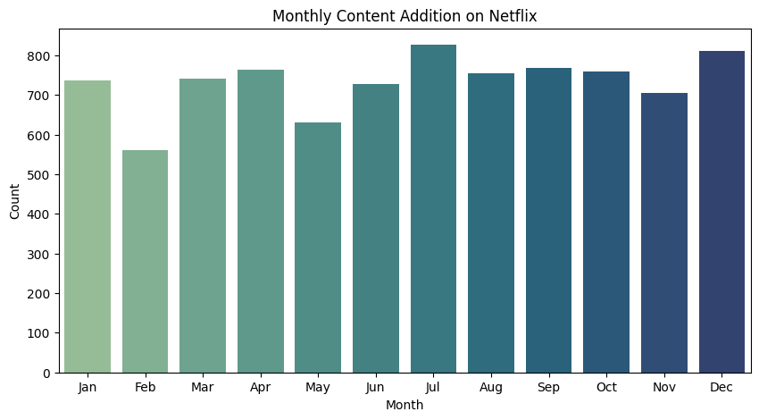

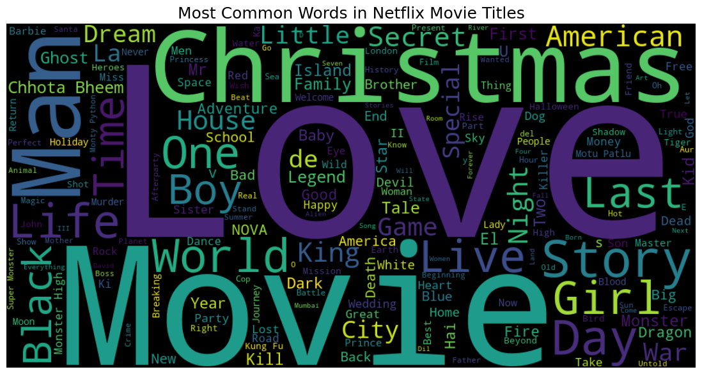

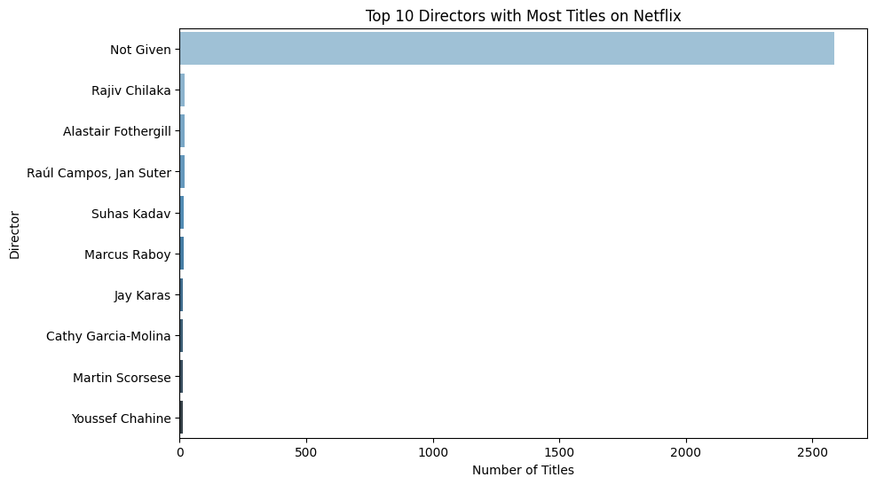

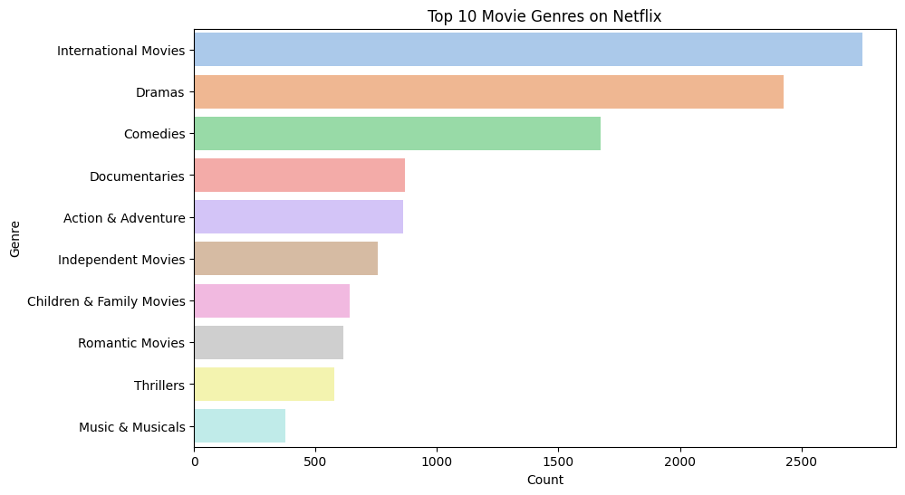

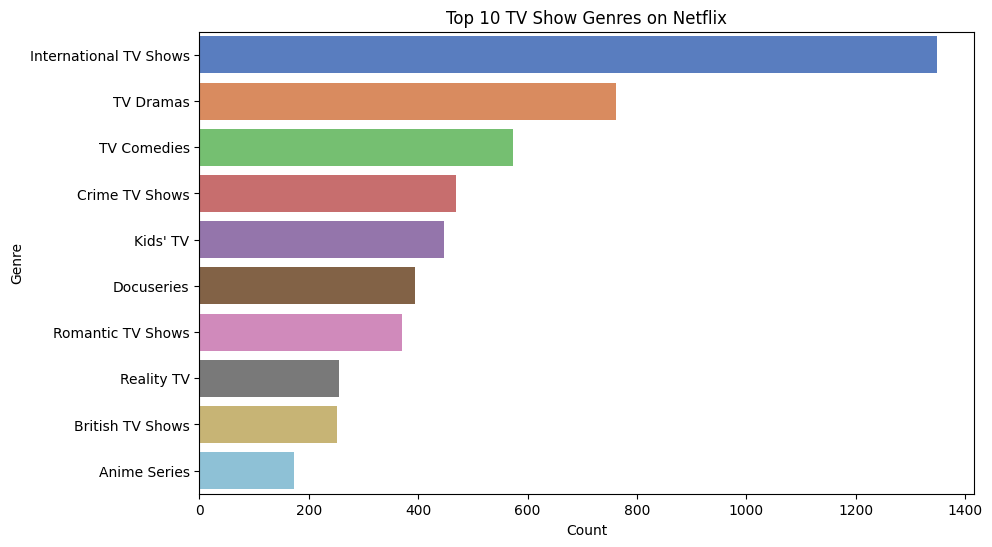

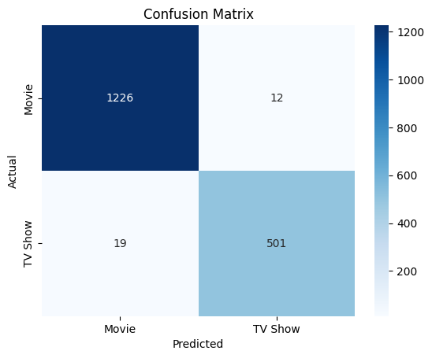

---

## 🧠 Machine Learning

### 1. Genre-Based Recommendation System (NLP)
- Implemented using **TF-IDF Vectorizer** and **Cosine Similarity**
- Returns top 5 similar shows for any Netflix title
- Example:
Input: Narcos
Recommendations: Narcos: Mexico, Queen of the South, Shooter, etc.

---

### 2. Classification Model – Movie vs TV Show
- Used Logistic Regression to classify content type
- Inputs: `release_year`, `rating`, `duration`, etc.
- Evaluated using accuracy score and confusion matrix  
- Implemented in `analysis/netflix_analysis.ipynb`

---

## 📊 Power BI Dashboards

### Dashboard 1: Netflix Content Overview  

---

### Dashboard 2: Genre & Rating Insights  

---

### Dashboard 3: Titles, Durations & Origins  

---

## 📥 Power BI File

📂 Download and open in Power BI Desktop:  
👉 [`netflix_dashboard.pbix`](netflix_dashboard.pbix)

---

## 👩‍💻 Author

**Silla Shaju**  
📌 MSc Data Science | Data Analyst Intern  
🎓 Internship at Unified Mentor Pvt Ltd  
🔗 [GitHub](https://github.com/si-lla)
